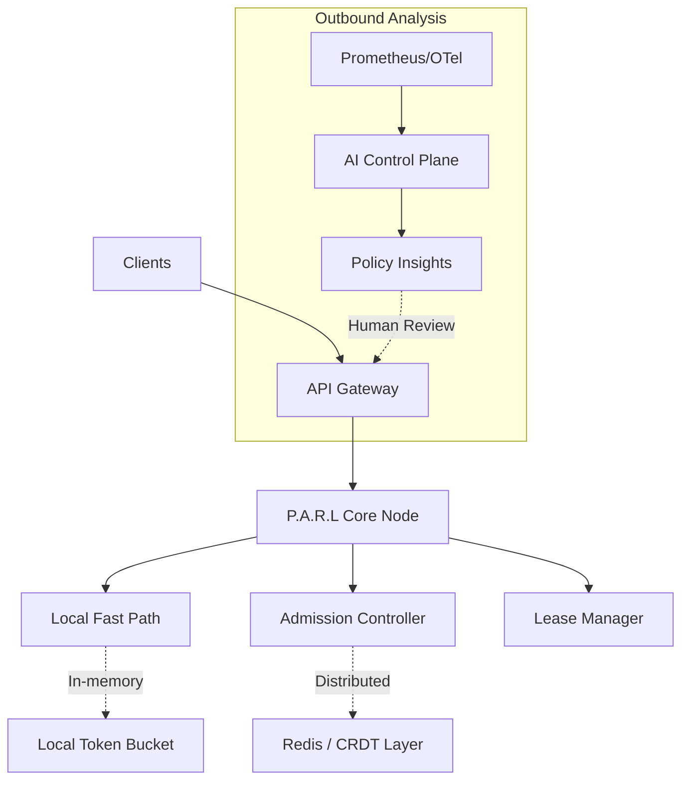

# 🌌 Valvo (P.A.R.L-AI)

> **Planet-Scale Adaptive Rate Limiter with AI Control Plane**

Valvo is a high-performance, distributed rate-limiting system designed to enforce multi-dimensional quotas with microsecond-level latency. It bridges the gap between deterministic admission control and intelligent operational observability.

---

## ✨ Overview

Valvo (P.A.R.L-AI) is engineered for resilience and scale. It prioritizes sub-millisecond local decisions while maintaining bounded global correctness across multiple regions. By separating the **Deterministic Admission Core** from the **AI Control Plane**, it ensures that your application remains safe and fast, regardless of the complexity of your rate-limiting policies.

### 🚀 Key Philosophies

- **Zero-Latency Hot Path**: No network calls, disk I/O, or AI involvement in request admission.
- **Microsecond Decisions**: local fast-path execution ensures minimal overhead.
- **Bounded Global Correctness**: Eventually consistent global views with strictly capped quota overshoot.
- **Separation of Concerns**: AI provides insights and policy recommendations out-of-band, never blocking traffic.

---

## 🏗️ Architecture

Valvo employs a multi-tiered approach to rate limiting, combining local in-memory states with a distributed Redis-backed global layer.



---

## 🛠️ Core Features

### 1. Multi-Dimensional Rate Limiting
Apply limits based on any combination of identifiers:
- **Tenant ID**: Isolate quotas between different customers.
- **Region**: Geospatial rate limiting for edge deployments.
- **Resource/API**: Fine-grained control over specific endpoints.
- **User ID**: Per-user throttling within a tenant.

### 2. Tiered Decision Engine
The admission controller provides three distinct response levels:
- ✅ **ALLOW**: Request is within quota.
- 🟡 **SOFT_DENY**: Request is throttled (grace mode/probabilistic). Useful for smoothing transitions.
- 🚫 **HARD_DENY**: Request is immediately rejected to protect system integrity.

### 3. Distributed Token Bucket
Atomic token bucket operations implemented via optimized **Redis Lua scripts**, ensuring no race conditions and minimal round-trips.

### 4. Bounded Quota Leases
Nodes operate under time-bound quota leases. This avoids global coordination on every request, allowing the system to remain available even during network partitions.

### 5. Automated Metrics & Observability
Built-in instrumentation for:
- Request throughput (Allowed vs. Denied)
- Redis connectivity health
- Quota overshoot percentages
- Predictor accuracy for burst detection

---

## 📦 Project Structure

```text
Valvo/
├── internal/
│   ├── admission/      # Limiter implementations (Local, Distributed)
│   ├── redis/         # Redis Lua scripts and client logic
│   └── fastpath/      # Low-latency memory-based algorithms
├── middleware/         # HTTP/gRPC middleware integrations
├── metrics/           # Prometheus/Standard metrics instrumentation
├── docs/              # Detailed Architecture and Design specs
└── ratelimit.proto    # gRPC service definition
```

---

## 🚀 Getting Started

### Prerequisites
- **Go**: 1.24+
- **Redis**: 7.0+

### Installation
```bash
go get github.com/aasimkhan02/Valvo
```

### Basic Usage

```go
import (
    "github.com/aasimkhan02/Valvo/internal/admission"
    "github.com/redis/go-redis/v9"
)

// Initialize Redis client
rdb := redis.NewClient(&redis.Options{Addr: "localhost:6379"})

// Create a local limiter for fast path
local := admission.NewLocalLimiter()

// Create the distributed limiter
limiter := admission.NewDistributedLimiter(local, rdb, 1000, 100) // cap=1000, rate=100/s

// Check a limit
res := limiter.Check(internal.RateLimitKey{
    Tenant:   "acme-inc",
    Region:   "us-east-1",
    Resource: "/v1/inference",
}, time.Now().UnixNano())

if res.Decision == admission.ALLOW {
    // Proceed with request
}
```

---

## 📜 API Definition

Valvo exposes a stable gRPC interface for external consumers. Check [ratelimit.proto](ratelimit.proto) for details.

```protobuf
service RateLimitService {
  rpc CheckRateLimit(CheckRateLimitRequest) 
      returns (CheckRateLimitResponse);
}
```

---

## 🛡️ License

Valvo is licensed under the MIT License. See [LICENSE](LICENSE) for details. (Coming Soon)

---

<p align="center">
  Built with ❤️ for planet-scale infrastructure.
</p>
